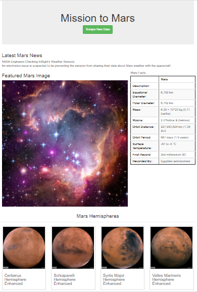

# Mission-to-Mars
New project on Mission to Mars analysis. Adjusting the current web app.

## Project Overview
This project will be using Python, Pandas, MongoDB, Splinter and Flask to adjust the current web app to include all four of the hemisphere images. To do this, BeautifulSoup and Splinter will be used to scrape full-resolution images of Mars’s hemispheres and the titles of those images, store the scraped data on a Mongo database, use a web application to display the data, and alter the design of the web app to accommodate these images. Ergo, this assignment consists of three technical deliverables. They are:

- Deliverable 1: Scrape Full-Resolution Mars Hemisphere Images and Titles
- Deliverable 2: Update the Web App with Mars Hemisphere Images and Titles
- Deliverable 3: Add Bootstrap 3 Components

## Purpose
The purpose of this project is to scrape the images of the Mar's hemisphere online as well as to adjust the current web app to include all four of the hemishphere images. This project will also deliver on all three (3) deleverables previously outlined.

## Resources
- **Data Source:** index.html, Mission_to_Mars_Challenge_starter_code.ipynb, Mission_to_Mars.ipynb, app.py, scraping.py
- **Software:** Anaconda 4.8.3, Jupyter Notebook 6.0.3, Visual Code 1.47, Python 3.7.6, BeautifulSoup, MongoDB, Splinter, Flask

## Mission-to-Mars Results
>
>**Image showing the Mission to Mars web app:**
>
>
