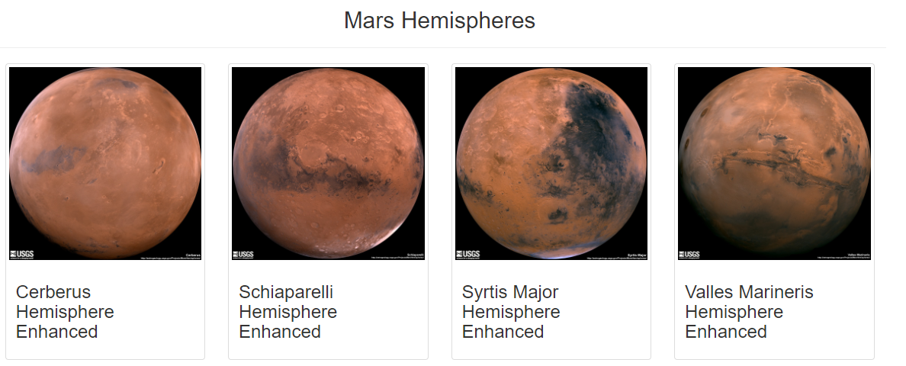

# Mission-to-Mars
New project on Mission to Mars analysis. Making changes to the weather app.

## Project Overview
This project will be using Python, Pandas and API Keys to create a travel and destination map fuse with weather data. It has been recommended that a few changes are to me made in order to take the app to the next level. Recommendations requested specifically asks for adding the weather description to the weather data already retrieved. Afterwhich, the beta testers will use input statements to filter the data for their weather preferences, which will be used to identify potential travel destinations and nearby hotels. From the list of potential travel destinations, the beta tester will choose four cities to create a travel itinerary. Finally, using the Google Maps Directions API, a travel route will be ctreated between the four cities as well as a marker layer map. Ergo, this assignment consists of three technical deliverables. They are:

- Deliverable 1: Scrape Full-Resolution Mars Hemisphere Images and Titles
- Deliverable 2: Update the Web App with Mars Hemisphere Images and Titles
- Deliverable 3: Add Bootstrap 3 Components

## Purpose
The purpose of this project is to scrape the images of the Mar's hemisphere online as well as to addjust the current web app to include all four of the hemishphere images. This project will also deliver on all three (3) deleverables previously outlined.

## Resources
- **Data Source:** index.html, Mission_to_Mars_Challenge_starter_code.ipynb, Mission_to_Mars.ipynb, app.py, scraping.py
- **Software:** Anaconda 4.8.3, Jupyter Notebook 6.0.3, Visual Code 1.47, Python 3.7.6, BeautifulSoup, MongoDB, Splinter, Flask

## Mission-to-Mars Results
>
>**Image showing the hemisphere images as thumbnails:**
>
>
